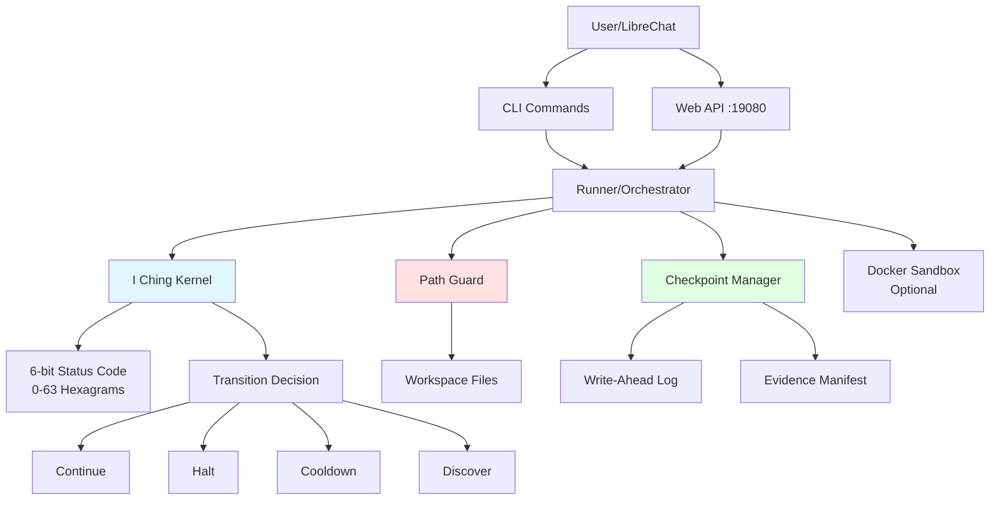
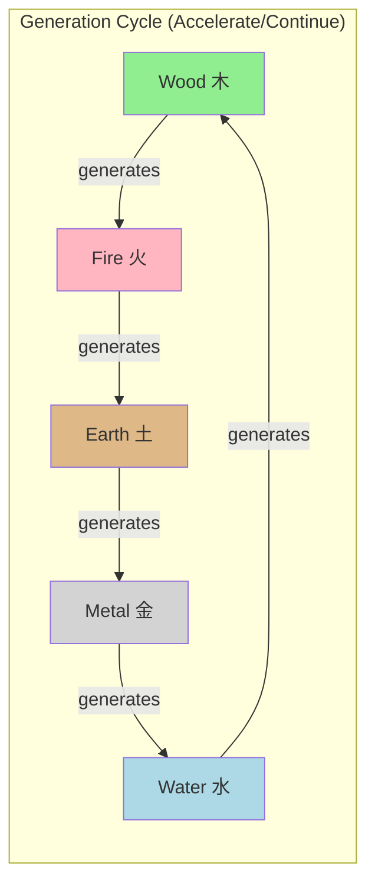
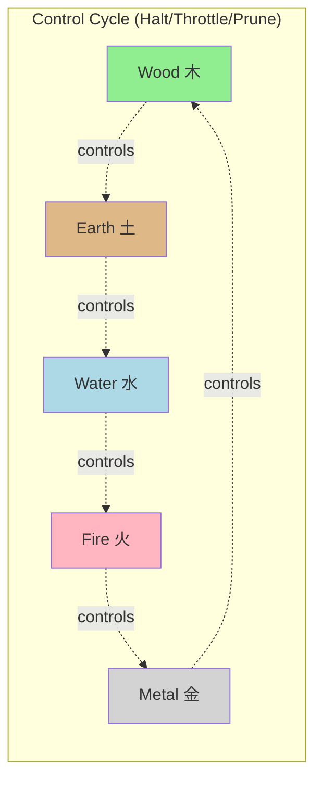
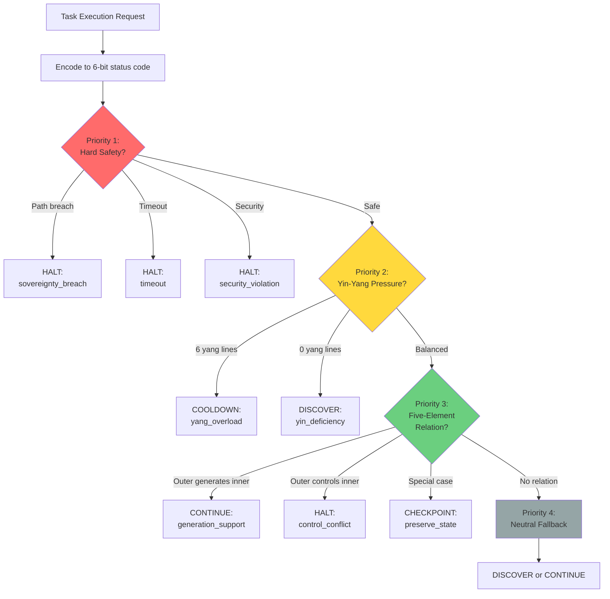
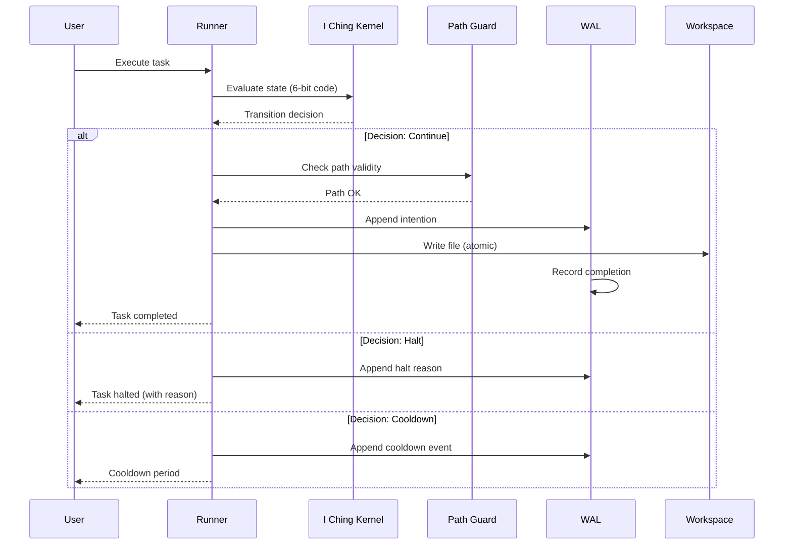
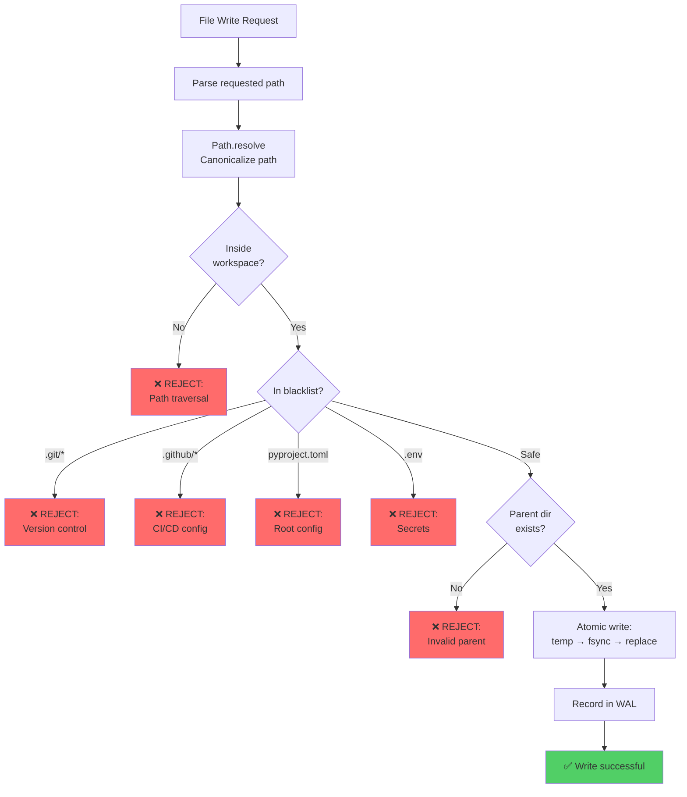
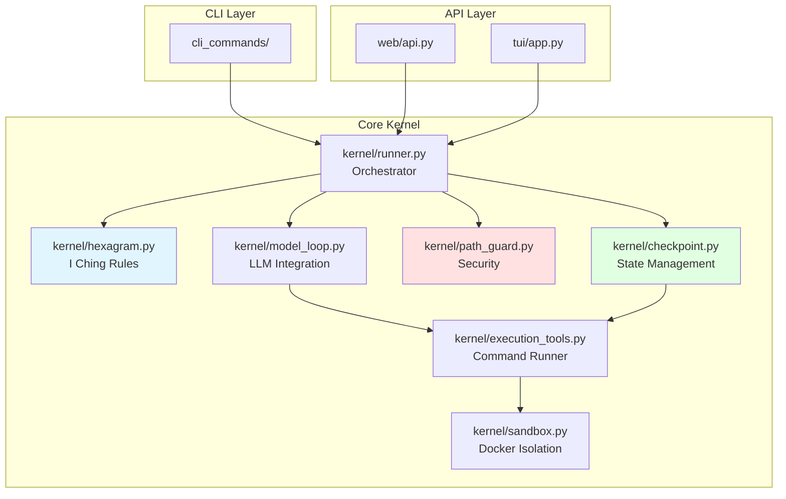
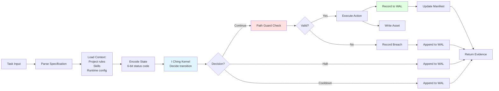

# OneCode Architecture

This document provides visual architecture diagrams to complement the textual design documents.

## System Overview



## I Ching State Machine

### Hexagram Structure

```
Status Code 40 = 0b101000 = Binary representation

Bit position:  5 4 3 | 2 1 0
Binary value:  1 0 1 | 0 0 0
               ─────   ─────
               Outer   Inner
               Trigram Trigram
                 |       |
                Li      Kun
              (Fire)  (Earth)
```

### State Transition Flow

```mermaid
stateDiagram-v2
    [*] --> EvaluateTask
    
    EvaluateTask --> CheckSafety: Encode 6-bit status
    
    CheckSafety --> Halt: Path breach<br/>Timeout<br/>Security violation
    CheckSafety --> AnalyzeBalance: Safety OK
    
    AnalyzeBalance --> Cooldown: Pure yang<br/>(6 yang lines)
    AnalyzeBalance --> Discover: Pure yin<br/>(0 yang lines)
    AnalyzeBalance --> CheckElements: Balanced<br/>(3-4 yang lines)
    
    CheckElements --> ElementRelation[Evaluate<br/>Five-Element Relation]
    
    ElementRelation --> Continue: Generation cycle<br/>(outer generates inner)
    ElementRelation --> Halt: Control cycle<br/>(outer controls inner)
    ElementRelation --> Checkpoint: Special relations
    
    Cooldown --> [*]
    Halt --> [*]
    Continue --> [*]
    Discover --> [*]
    Checkpoint --> [*]
```

## Five-Element Relations

### Element Cycles





### Trigram to Element Mapping

| Trigram | Chinese | Binary | Element | Attributes |
|---------|---------|--------|---------|------------|
| Qian 乾 | ☰ | 111 | Metal | Creative, strong, heaven |
| Dui 兑  | ☱ | 110 | Metal | Joyful, lake |
| Li 离   | ☲ | 101 | Fire  | Radiant, clarity, fire |
| Zhen 震 | ☳ | 100 | Wood  | Arousing, thunder |
| Xun 巽  | ☴ | 011 | Wood  | Gentle, wind |
| Kan 坎  | ☵ | 010 | Water | Abysmal, water |
| Gen 艮  | ☶ | 001 | Earth | Keeping still, mountain |
| Kun 坤  | ☷ | 000 | Earth | Receptive, earth |

## Decision Priority Hierarchy



## Execution Flow with Evidence Chain



## Path Guard Security Model



## Docker Sandbox Isolation

```mermaid
graph LR
    subgraph Host System
        Runner[OneCode Runner]
    end
    
    subgraph Docker Container
        subgraph Restrictions
            NoNet[❌ Network disabled<br/>--network=none]
            NoCap[❌ All capabilities dropped<br/>--cap-drop=ALL]
            ReadOnly[❌ Root filesystem read-only<br/>--read-only]
            Limited[⚠️ Memory: 512MB<br/>⚠️ CPUs: 1<br/>⚠️ PIDs: 256]
        end
        
        Exec[Command Execution<br/>shell=False]
        TmpFS[/tmp tmpfs<br/>noexec, nosuid, 64MB]
        Mount[Workspace mount<br/>read-write]
    end
    
    Runner -->|Execute| Exec
    Exec --> Mount
    
    style NoNet fill:#ff6b6b
    style NoCap fill:#ff6b6b
    style ReadOnly fill:#ff6b6b
    style Limited fill:#ffd93d
    style Mount fill:#51cf66
```

## Common Status Code Examples

| Code | Binary | Outer/Inner | Elements | Relation | Typical Decision | Reason |
|------|--------|-------------|----------|----------|------------------|--------|
| 0 | 000000 | Kun/Kun | Earth/Earth | Same | Discover | Pure yin, rule gap |
| 17 | 010001 | Kan/Gen | Water/Earth | Control | Checkpoint | Water over earth, preserve |
| 35 | 100011 | Zhen/Xun | Wood/Wood | Same | Cooldown | High yang, throttle |
| 39 | 100111 | Zhen/Qian | Wood/Metal | Control | Cooldown | Yang overload |
| 40 | 101000 | Li/Kun | Fire/Earth | Control | Halt | Sovereignty breach |
| 49 | 110001 | Dui/Gen | Metal/Earth | Generate | Continue | Generation support |
| 63 | 111111 | Qian/Qian | Metal/Metal | Same | Cooldown | Pure yang, maximum |

## Module Dependencies



## Data Flow: Task Execution



---

## Additional Resources

- [I Ching Complete Rule Kernel Design](superpowers/specs/2026-05-28-onecode-v0.5-iching-complete-rule-kernel-design.md) - Mathematical foundations
- [CONTRIBUTING.md](../CONTRIBUTING.md) - Required reading for developers
- [INDEX.md](INDEX.md) - Full documentation index

For interactive exploration:
```bash
onecode doctor           # Run smoke tests with status code examples
onecode math-audit       # Verify state space integrity
onecode inspect --run-id <id>  # View hexagram details for a specific run
```
