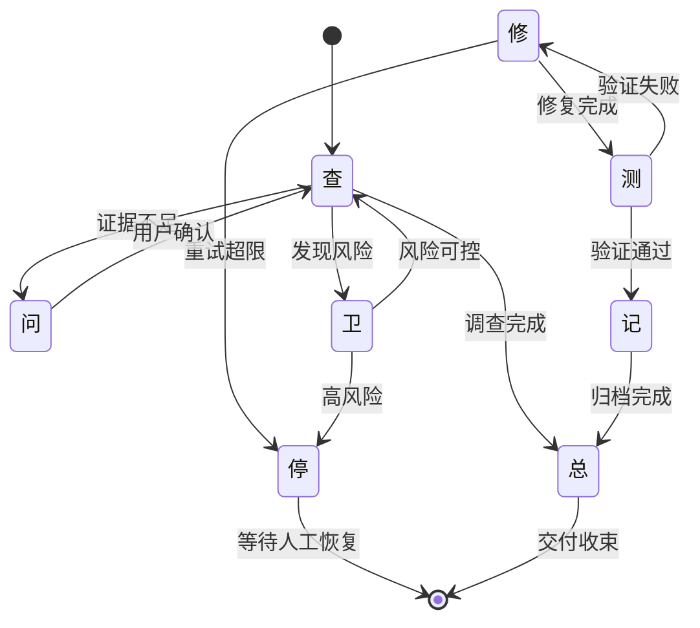

# OneWord-Agent FSM 框架

日期：2026-05-24
定位：V0.4 框架层原型
状态：可测试的 Python FSM 骨架已落地，真实工具执行器仍在后续阶段

## 1. 框架定位

OneWord-Agent 是一字诀在网关之上的框架层原型。它的目标不是让大模型自由规划，而是让 Agent 永远运行在 8 个确定状态之一：

```text
查 / 修 / 测 / 卫 / 停 / 问 / 记 / 总
```

这 8 个根字就是 Agent 的行为原语。用户自然语言先被编译成初始根字，执行器按该根字加载 Kernel Runtime Policy、Workflow 规范、工具权限和证据要求，再根据真实执行结果触发状态转移。

一字诀当前分三层：

```text
Gateway 中间层
  负责 OpenAI-compatible 请求重写、规则注入、工具过滤和 HTTP 熔断。

Kernel Runtime Policy
  负责 8 个根字的工具白名单、温度覆盖、硬 System Prompt 和证据字段。

OneWord-Agent FSM 框架层
  负责把复杂任务跑成可审计的状态轨迹，而不是让模型在长 ReAct 循环里自由漂移。
```

## 2. 状态机总览



这个图表达的是框架原则，不是唯一流程。实际复杂任务可以先由 `macro_chain.py` 编译成闭环链，例如：

```text
功能开发: 查 -> 造 -> 测 -> 修 -> 记 -> 总
安全熔断: 卫 -> 停 -> 问 -> 查 -> 总
```

注意：`造` 是 `修` 的派生字，不是根字。根字层仍保持 8 个行为原语，避免底层指令集膨胀。

## 3. 八个状态

| 状态 | 根字 | 运行含义 | 权限基因 | 主要证据 |
| --- | --- | --- | --- | --- |
| 离 | `查` | 只读调查 | Read-only | 文件、行号、日志、搜索结果 |
| 震 | `修` | 外科手术式修复 | Scoped write | diff、修改行号、修复逻辑 |
| 巽 | `测` | 验证与测试 | Execute-only | stdout、exit code、覆盖率 |
| 坎 | `卫` | 安全防护 | Guard filter | 风险等级、阻断原因 |
| 艮 | `停` | 熔断挂起 | No tools | 熔断原因、失败计数 |
| 兑 | `问` | 澄清与授权 | User prompt | 结构化用户确认 |
| 坤 | `记` | 项目记忆 | Storage write | 文件路径、hash |
| 乾 | `总` | 收束交接 | Context compress | 摘要、风险、下一步 |

这里的卦象只是工程建模语言：状态是字，阶段是 workflow，变卦是状态转移。真正执行权在代码、权限和证据门里，而不是交给模型临场解释。

## 4. 核心组件

当前代码入口：

```text
agent_skill_dictionary/one_word_agent.py
```

包含三个核心组件：

```text
Compiler
  把用户自然语言编译成初始 OneWordState。

MutationEngine
  根据执行结果决定下一个状态，例如测失败转修，连续失败转停。

OneWordAgent
  运行状态循环，逐步加载 KernelPolicy，记录 trace 和 audit_log。
```

当前状态映射：

```text
LI    = 离 / 查
ZHEN  = 震 / 修
XUN   = 巽 / 测
KAN   = 坎 / 卫
GEN   = 艮 / 停
DUI   = 兑 / 问
KUN   = 坤 / 记
QIAN  = 乾 / 总
```

## 5. 运行生命周期

OneWord-Agent 的一次运行遵循固定生命周期：

1. `Compiler.compile()` 从用户输入得到初始状态。
2. `OneWordAgent.run()` 读取当前状态对应的 `KernelPolicy`。
3. 框架把状态、允许工具、证据要求写入 `audit_log`。
4. `execute_llm_core()` 执行当前状态下的真实任务。
5. `MutationEngine.next_state()` 根据执行结果做状态转移。
6. 命中 `停` 时挂起，命中 `总` 时完成。

执行结果的最小契约：

```python
{
    "ok": True,              # 当前状态是否成功
    "risk": "high",          # 可选，高风险会转停
    "needs_human": False     # 可选，需要人类确认会转问
}
```

后续真实执行器可以把 `test_exit_code`、`coverage`、`tool_guard`、`evidence_hash` 等字段补进去，作为更严格的状态转移依据。

## 6. 使用示例

```python
from agent_skill_dictionary.one_word_agent import OneWordAgent

agent = OneWordAgent(codebase_path="/path/to/project")
result = agent.run("这里有个 bug，跑不通了，帮我修好并验证。")

print(result["status"])
print(result["trace"])
print(result["audit_log"])
```

当前默认执行器是测试桩：`execute_llm_core()` 默认返回 `{"ok": True}`。也就是说，V0.4 的 OneWord-Agent 已经能验证状态编译、状态转移、熔断和审计轨迹，但还没有接入真实 LLM、真实工具和真实沙盒证据。

要接入生产执行器，应继承 `OneWordAgent` 并覆写：

```python
def execute_llm_core(self, state, policy, context):
    ...
```

覆写实现必须遵守：

- 只下放 `policy.allowed_tools` 内的工具。
- 把模型温度和 system prompt 交给 `kernel_policy.py` 管理。
- 执行工具前调用 `/v1/yizijue/preflight-tool` 或等价本地检查。
- 把系统层 stdout、stderr、exit code、hash 写进 result。
- 证据不足时返回 `{"ok": False}` 或 `{"needs_human": True}`，不要让模型自称通过。

## 7. 与优秀社区工作流的关系

OneWord-Agent 不复制外部项目，也不把某个 GitHub 仓库写死成依赖。它吸收的是优秀工作流的工程精髓：

```text
查 = Reader-only + 最小上下文 + 证据绑定
修 = systematic debugging + TDD + surgical change
测 = verification-before-completion + CI evidence gate
卫 = PreToolUse guard + zero-trust permission
停 = tripwire + interrupt/resume
问 = human-in-the-loop + permission request
记 = project memory + ADR
总 = context compaction + handoff summary
```

每个字背后的专业规范落在三个地方：

```text
agent_skill_dictionary/workflows/*.md
agent_skill_dictionary/kernel_policy.py
agent_skill_dictionary/programming-agent-skill-dictionary.json
```

因此，一字诀不能承诺“绝对零幻觉”，但它能把 Agent 的自由度收窄到：当前状态、当前工具、当前证据和当前转移规则之内。

## 8. 当前测试

测试入口：

```text
tests/test_one_word_agent.py
```

覆盖内容：

- 8 个状态到根字和卦象的映射。
- Compiler 对 bug、报错和默认调查意图的归一化。
- MutationEngine 对失败重试和三次熔断的处理。
- OneWordAgent 输出可审计 trace 和 audit_log。
- 连续失败时自动进入 `停`。

## 9. 当前边界

OneWord-Agent 当前是框架原型，不是完整 AgentOS：

- 还没有 `/v1/yizijue/run` 多步执行 endpoint。
- 还没有真实 LLM executor adapter。
- 还没有把工具执行层强制接入 preflight。
- 还没有审计日志落盘和证据 hash 文件落盘。
- 还没有把 Macro Chain 自动展开成真实多步任务执行。

下一阶段最值得做的是 executor adapter：让 `OneWordAgent` 调用当前 Gateway 重写逻辑、KernelPolicy、tool preflight 和 audit 模块，跑通一个真实的 `查 -> 修 -> 测 -> 记 -> 总` 小闭环。
